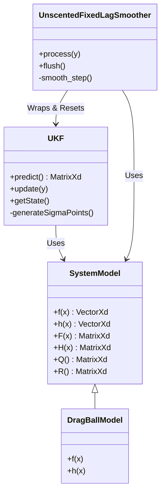
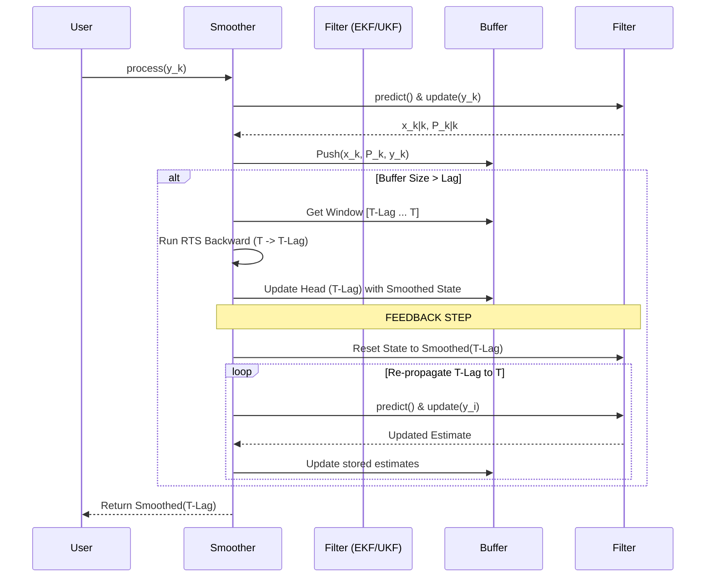

# Modern Computational Nonlinear Filtering

This repository implements high-performance, nonlinear filtering and smoothing algorithms in C++. It focuses on handling complex dynamical systems with noise using Extended Kalman Filters (EKF) and Unscented Kalman Filters (UKF), coupled with a robust Fixed-Lag Smoother architecture.

## Overview

The project provides a flexible framework for state estimation:
*   **System Models**: Abstract base classes for defining nonlinear dynamics ($f$) and observations ($h$).
*   **Filters**: Standard EKF (Jacobian-based) and UKF (Sigma-Point based).
*   **Smoothers**: Fixed-Lag Smoothing with Feedback. This advanced architecture uses the smoothed estimate at the tail of the lag window to reset the forward filter, allowing for iterative refinement of the trajectory and better handling of linearization errors.

## Contents

*   **EKF**: Implementation of the Extended Kalman Filter.
*   **UKF**: Implementation of the Unscented Kalman Filter (Merwe Scaled Sigma Points).
*   **Smoothers**:
    *   `FixedLagSmoother`: RTS smoothing logic adapted for EKF.
    *   `UnscentedFixedLagSmoother`: Unscented RTS smoothing logic for UKF.
*   **Models**:
    *   `BallTossModel`: Simple projectile motion (linear-ish).
    *   `DragBallModel`: High-speed projectile with quadratic air drag and wind turbulence (highly nonlinear).

## Architecture & Diagrams

### Class Structure



### Smoothing Feedback Loop

The core innovation is the feedback loop where the smoothed "past" corrects the "present" filter trajectory.



## Installation & Build

### Prerequisites
*   **C++ Compiler** (C++14 or later)
*   **CMake** (3.10+)
*   **Eigen3** (Linear Algebra Library)
*   **Python 3** with `matplotlib` and `pandas` (Optional, for graphical results)

### Installing Eigen3
If Eigen3 is not installed systematically, you can download it locally:
```bash
mkdir -p eigen_install
wget -qO eigen.tar.gz https://gitlab.com/libeigen/eigen/-/archive/3.4.0/eigen-3.4.0.tar.gz
tar -xzf eigen.tar.gz -C eigen_install
mv eigen_install/eigen-3.4.0 eigen_install/eigen3
```
*Note: You may need to update `CMakeLists.txt` or use `-D Eigen3_DIR=...` to point to your specific Eigen installation if it's not found automatically.*

### Building the Project
```bash
cd EKF
mkdir build && cd build
cmake ..
make
```

## Usage

### Running Tests

The project includes two main test executables:

1.  **`ekf_test`**:
    *   Simulates a simple Ball Toss scenario.
    *   Compares EKF Forward Filtering vs Fixed-Lag Smoothing.
    ```bash
    ./ekf_test
    ```

2.  **`ukf_test`**:
    *   Simulates a **High-Speed Drag Ball** with random wind forces.
    *   Uses UKF and Unscented Smoothing.
    ```bash
    ./ukf_test
    ```

### Graphical Output
Both tests support a `--graphics` flag to generate and display plots of the trajectory, error, and $3\sigma$ bounds.

```bash
./ekf_test --graphics
./ukf_test --graphics
```
*Requires Python 3 with `matplotlib` and `pandas`.*
This will save plots to `ekf_results.png` / `ukf_results.png` and attempt to open a window if a display is available.

### Output Interpretation
The text output shows the position/velocity at each step and compares the **Filtered Error** (Standard Filter) against the **Smoothed Error** (Feedback Smoother).
```
Results (Time | True Z | Filt Z (Err) | Smooth Z (Err)):
t=1.00 | 15.13 | 15.03 (0.49) | 15.02 (0.45)
...
SUCCESS: Smoothing reduced error.
```
